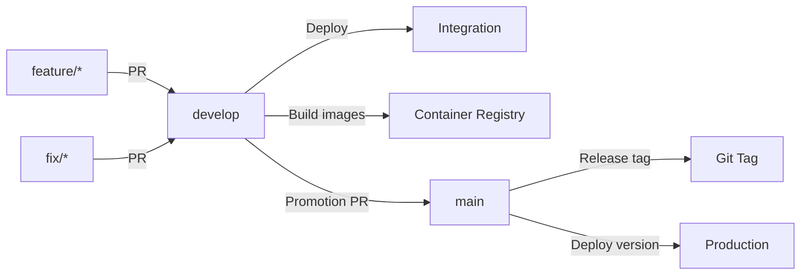

# Feuerwehr-KPP (Klein Parin Pohnsdorf)

Monorepo fuer die Feuerwehr-Anwendung auf Basis von .NET 10 und Avalonia.

[](https://github.com/Sanifant/Feuerwehr-KPP/actions/workflows/ci.yml)

[](https://sonarcloud.io/summary/new_code?id=Sanifant_Feuerwehr-KPP)

## Einsatzkontext

Die Software ist fuer den Einsatz bei Feuerwehren vorgesehen.


Der Fokus liegt auf einem stabilen und nachvollziehbaren Betrieb in Einsatz.

## Nicht-funktionale Leitplanken

- Hohe Verfuegbarkeit im Einsatzbetrieb
- Nachvollziehbarkeit von Aenderungen und Prozessen
- Datenschutzgerechte Verarbeitung einsatzrelevanter Daten
- Rollenbasierte Nutzung und klare Berechtigungskonzepte

## Projektueberblick

Die Solution liegt unter `src/Feuerwehr.slnx` und umfasst:

- Common: Geteilte Modelle und Kernlogik (inkl. Inventory-Service und Repository-Interfaces)
- App: Die Avalonia UI Applikationen für Windows, Linux, Android un IOS
- Backend: ASP.NET Core Web API
- Frontend: React Frontend für die Pflege der Daten innerhalb der Software
- AppHost: .NET Aspire, um den Entwicklungsprozess zu vereinfachen


## Deployment Flow



## Funktionsumfang

### Hydranten Management

- REST PI zur Verwaltung von Hydranten und deren Standort
- CRUD-Operationen für Hydranten:
  - `GET: api/Hydrant` - Alle Hydranten abrufen
  - `GET api/Hydrant/{id]` - Einzelnen Hydrant abrufen
  - `POST api/Hydrant` - Neuen Hydrant anlegen; Benutzer muss Recht `CanManageHydrant` haben.
  - `PUT api/Hydrant/{Id}` - Hydrant aktualisieren;  Benutzer muss Recht `CanManageHydrant` haben.
  - `DELETE api/Hydrant/{id}` - Hydrant entfernen;  Benutzer muss Recht `CanManageHydrant` haben.

### Geraete-Verwaltung (Inventory Management)
- REST API zur Verwaltung von Feuerwehr-Inventar und Geraeten
- CRUD-Operationen fuer Inventargegenstände:
  - `GET /api/InventoryItem` - Alle Geraete abrufen
  - `GET /api/InventoryItem/{id}` - Einzelnes Geraet abrufen
  - `POST /api/InventoryItem` - Neues Geraet anlegen
  - `PUT /api/InventoryItem/{id}` - Geraet aktualisieren
  - `DELETE /api/InventoryItem/{id}` - Geraet loeschen
- Repository-Pattern zur Entkopplung von Datenzugriff und Geschaeftslogik
- Service-Layer fuer Geschaeftslogik und Orchestrierung

## Voraussetzungen

- .NET SDK 10.0
- Docker und Docker Compose fuer das Development Environment
- Fuer Mobile-Targets zusaetzlich:
    - Android SDK/Workloads
    - Xcode/Apple Tooling fuer iOS (unter macOS)

## Build

Aus dem Repo-Root:

```bash
dotnet restore src/de.openelp.feuerwehr.slnx
dotnet build src/de.openelp.feuerwehr.slnx
```

## Starten

Development Environment in VS Code:

```bash
code .
```

Anschliessend den Ordner im Devcontainer neu oeffnen. Dabei werden der Workspace-Container sowie `postgres`, `redis` und `pgadmin` automatisch ueber Docker Compose gestartet.

Manueller Start der relevanten Services ohne Devcontainer:

```bash
docker compose -f src/docker/docker-compose.yml -f src/docker/docker-compose.override.yml up -d postgres redis pgadmin de.openelp.feuerwehr.api
```

Web API:

```bash
dotnet run --project src/Web/de.openelp.feuerwehr/de.openelp.feuerwehr.Api.csproj
```

Desktop-App:

```bash
dotnet run --project src/Desktop/de.openelp.feuerwehr.desktop/de.openelp.feuerwehr.desktop.csproj
```

Mobile Browser Host:

```bash
dotnet run --project src/Mobile/de.openelp.feuerwehr.mobile.Browser/de.openelp.feuerwehr.mobile.Browser.csproj
```

## Changelog

Historie und relevante Aenderungen findest du in `CHANGELOG.md`.

## Weitere Dokumente

- Sicherheit: `Security.md`
- Support: `Support.md`
- Governance: `Governance.md`
- Datenschutz und Compliance: `Datenschutz.md`

## Beitrag leisten

Siehe `CONTRIBUTING.md` fuer Richtlinien zur Mitarbeit.
