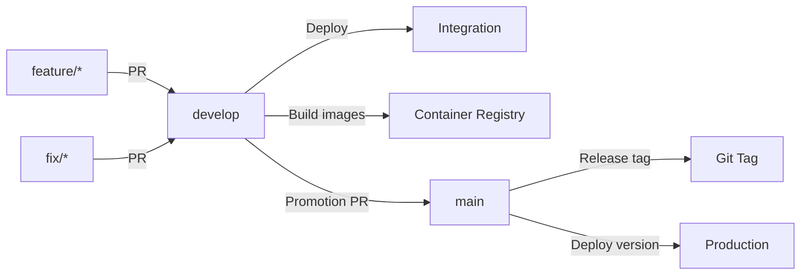

# Feuerwehr-KPP (Klein Parin Pohnsdorf)

Monorepo fuer die Feuerwehr-Anwendung auf Basis von .NET 10 und Avalonia.

[](https://github.com/Sanifant/Feuerwehr-KPP/actions/workflows/ci.yml)

[](https://sonarcloud.io/summary/new_code?id=Sanifant_Feuerwehr-KPP)

## Einsatzkontext

Die Software ist fuer den Einsatz bei Feuerwehren vorgesehen.


Der Fokus liegt auf einem stabilen und nachvollziehbaren Betrieb in Einsatz.

## Nicht-funktionale Leitplanken

- Hohe Verfuegbarkeit im Einsatzbetrieb
- Nachvollziehbarkeit von Aenderungen und Prozessen
- Datenschutzgerechte Verarbeitung einsatzrelevanter Daten
- Rollenbasierte Nutzung und klare Berechtigungskonzepte

## Projektueberblick

Die Solution liegt unter `src/Feuerwehr.slnx` und umfasst:

- `src/Feuerwehr.Common`: Geteilte Modelle und DTOs
- `src/App/Feuerwehr.App`: Avalonia-Client mit Projekten für Android, Desktop und iOS
- `src/Backend/Feuerwehr.Server`: ASP.NET Core Web API mit Datenzugriff, Authentifizierung und Migrationen
- `src/Backend/Tests.Feuerwehr.Backend`: Backend-Tests
- `src/frontend`: React-/TypeScript-Frontend auf Basis von Vite
- `src/Feuerwehr.AppHost`: .NET Aspire AppHost für API, Frontend, Datenbank, Cache und Mailpit


## Deployment Flow



## Funktionsumfang

### Hydranten Management

- REST PI zur Verwaltung von Hydranten und deren Standort
- CRUD-Operationen für Hydranten:
  - `GET: api/Hydrant` - Alle Hydranten abrufen
  - `GET api/Hydrant/{id]` - Einzelnen Hydrant abrufen
  - `POST api/Hydrant` - Neuen Hydrant anlegen; Benutzer muss Recht `CanManageHydrant` haben.
  - `PUT api/Hydrant/{Id}` - Hydrant aktualisieren;  Benutzer muss Recht `CanManageHydrant` haben.
  - `DELETE api/Hydrant/{id}` - Hydrant entfernen;  Benutzer muss Recht `CanManageHydrant` haben.

### Geraete-Verwaltung (Inventory Management)
- REST API zur Verwaltung von Feuerwehr-Inventar und Geraeten
- CRUD-Operationen fuer Inventargegenstände:
  - `GET /api/InventoryItem` - Alle Geraete abrufen
  - `GET /api/InventoryItem/{id}` - Einzelnes Geraet abrufen
  - `POST /api/InventoryItem` - Neues Geraet anlegen
  - `PUT /api/InventoryItem/{id}` - Geraet aktualisieren
  - `DELETE /api/InventoryItem/{id}` - Geraet loeschen
- Repository-Pattern zur Entkopplung von Datenzugriff und Geschaeftslogik
- Service-Layer fuer Geschaeftslogik und Orchestrierung

## Voraussetzungen

- .NET SDK 10.0
- Docker und Docker Compose fuer das Development Environment
- Fuer Mobile-Targets zusaetzlich:
    - Android SDK/Workloads
    - Xcode/Apple Tooling fuer iOS (unter macOS)

## Build

Aus dem Repo-Root:

```bash
dotnet restore src/Feuerwehr.slnx
dotnet build src/Feuerwehr.slnx
```

## Starten

Development Environment in VS Code:

```bash
code .
```

Anschliessend kann der AppHost gestartet werden. Er orchestriert API, Frontend, PostgreSQL, Redis und Mailpit.

AppHost:

```bash
dotnet run --project src/Feuerwehr.AppHost/Feuerwehr.AppHost.csproj
```

Web API:

```bash
dotnet run --project src/Backend/Feuerwehr.Server/Feuerwehr.Server.csproj
```

Desktop-App:

```bash
dotnet run --project src/App/Feuerwehr.App/Feuerwehr.App.Desktop/Feuerwehr.App.Desktop.csproj
```

Frontend:

```bash
cd src/frontend
npm install
npm run dev
```

## Changelog

Historie und relevante Aenderungen findest du in `CHANGELOG.md`.

## Weitere Dokumente

- Sicherheit: `Security.md`
- Governance: `Governance.md`
- Datenschutz und Compliance: `Datenschutz.md`

## Beitrag leisten

Siehe `CONTRIBUTING.md` fuer Richtlinien zur Mitarbeit.
